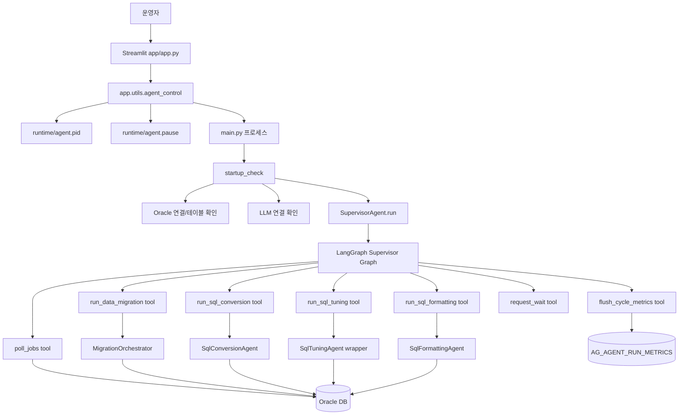
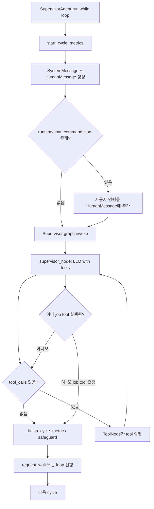
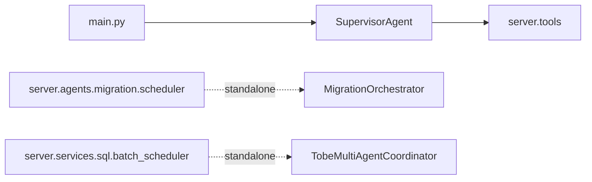
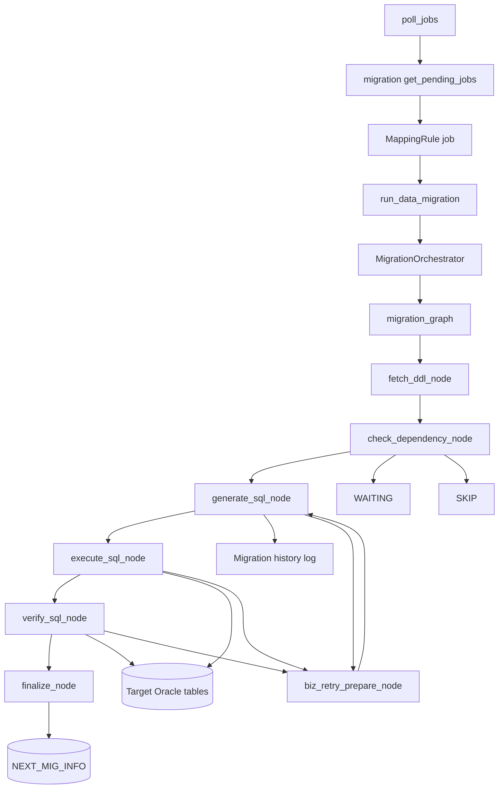
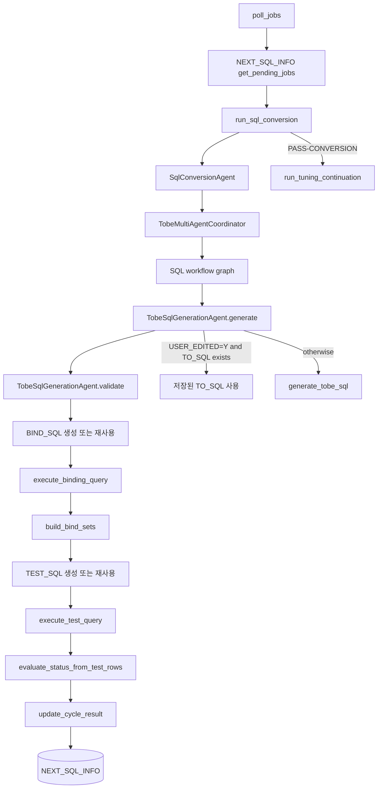
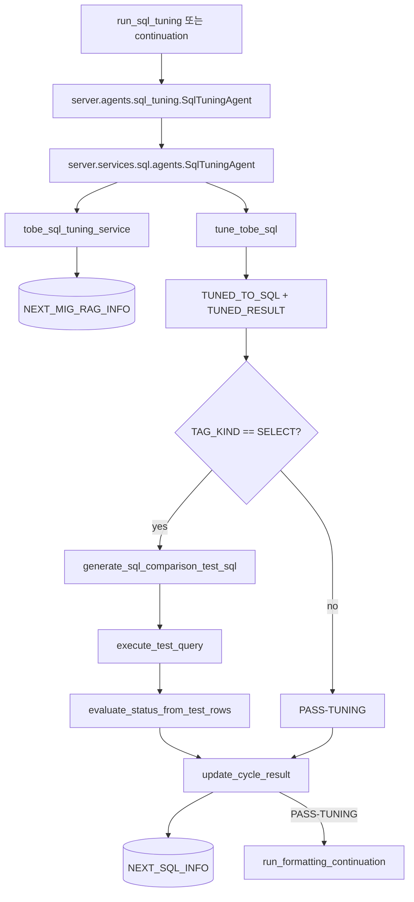
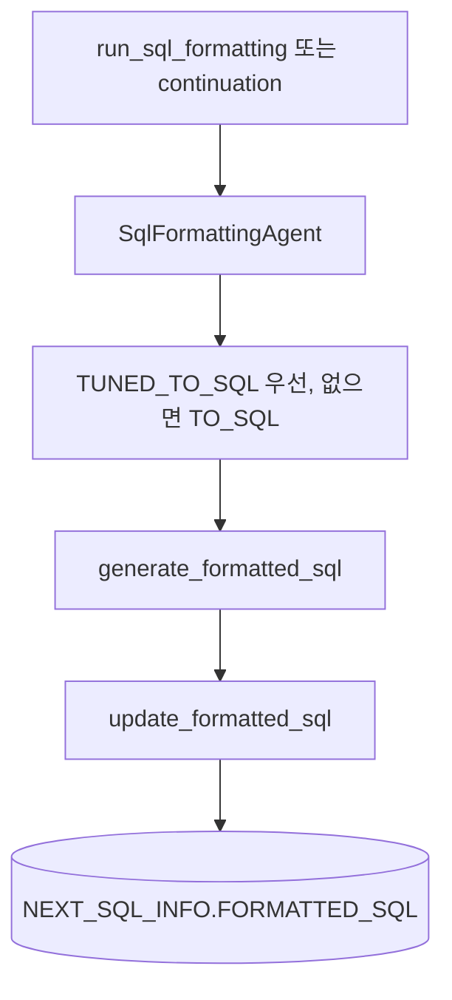
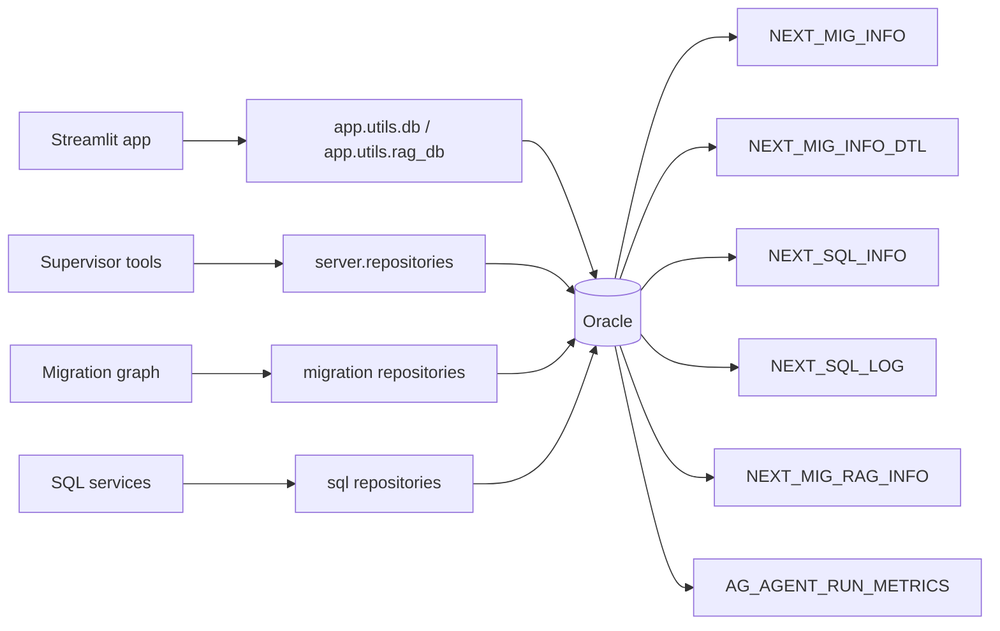
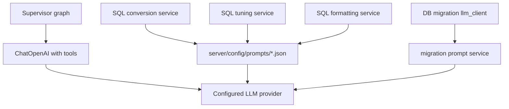

# 소스 구조 다이어그램

이 문서는 현재 Python 소스 코드만 분석합니다.
`langflow/`, `langflow_components/`는 이번 분석 대상에서 제외합니다.

## 1. 분석 범위

현재 저장소는 크게 두 개의 실행 표면을 가집니다.

```text
SmartMigrate_LangFlow-main
+- main.py                         # 배치 에이전트 프로세스 진입점
+- server/                         # 배치 런타임과 도메인 로직
+- app/                            # Streamlit 운영 콘솔
+- scripts/                        # DB 초기화/시드 스크립트
+- tests/                          # 테스트
+- table_ddl_comment/              # Oracle DDL/comment 자산
```

이 시스템은 단순 배치 스크립트가 아니라, 운영 UI와 멀티 에이전트 배치 런타임이 분리된 구조입니다.

- `main.py`는 배치 에이전트 프로세스를 시작합니다.
- `server.agents.supervisor`는 LangGraph와 tool 호출로 전체 cycle을 조율합니다.
- `server.tools`는 Supervisor LLM이 호출하는 결정적 tool wrapper입니다.
- `server.agents.*`는 Supervisor에 연결되는 agent wrapper와 migration graph를 포함합니다.
- `server.services.*`는 실제 변환/튜닝/검증/LLM/XML 처리 로직을 가집니다.
- `server.repositories.*`는 Oracle DB 접근 경계입니다.
- `app`은 DB 상태를 조회하고 `main.py` 백그라운드 프로세스를 제어하는 Streamlit 콘솔입니다.

## 2. 전체 런타임 관계



## 3. 실행 진입점

### `main.py`

운영 배치 프로세스의 진입점입니다.

```text
main.py
  -> .env 로드
  -> startup_check()
       -> Oracle 연결 확인
       -> LLM 연결 확인
       -> 필수 테이블 확인
  -> runtime/agent.pid 기록
  -> SupervisorAgent().run()
  -> 종료 시 pid/pause 파일 정리
```

### `app/app.py`

Streamlit 운영 콘솔입니다.

```text
streamlit run app/app.py
  -> 사이드바 메뉴 렌더링
  -> 에이전트 start/stop/pause/resume 제어
  -> 각 모니터링 페이지에서 Oracle 상태 조회
```

UI는 변환 로직을 직접 실행하지 않습니다. UI는 DB를 조회하고, 백그라운드 `main.py` 프로세스를 제어합니다.

## 4. Supervisor 런타임

Supervisor는 시스템의 최상위 조율자입니다. cycle을 반복하면서 LLM에게 현재 상태를 주고, LLM이 어떤 tool을 호출할지 결정합니다. 단, 실제 job 실행은 deterministic guard로 한 cycle당 하나만 허용합니다.

### 주요 모듈

```text
server/agents/supervisor/
+- agent.py      # cycle loop, signal handling, callback 주입
+- graph.py      # LangGraph: supervisor node <-> tool node
+- prompts.py    # Supervisor LLM system prompt
+- state.py      # SupervisorState

server/tools/
+- poll.py            # poll_jobs tool, job priority gating
+- migration.py       # run_data_migration tool
+- sql_conversion.py  # run_sql_conversion tool
+- sql_tuning.py      # run_sql_tuning tool
+- sql_formatting.py  # run_sql_formatting tool
+- sql_chain.py       # conversion 성공 후 tuning/formatting continuation
+- cycle.py           # flush_cycle_metrics, request_wait
+- context.py         # registry, callback, metric, active job 공유 상태
```

### Supervisor cycle



핵심 동작:

- Supervisor가 Oracle을 직접 조회하지 않습니다.
- `poll_jobs()`가 DB를 조회하고 registry를 채웁니다.
- job tool은 registry에서 선택된 job을 꺼내 callback으로 실제 agent를 호출합니다.
- callback은 `SupervisorAgent.__init__`에서 주입됩니다.
- `claim_job_execution()`이 한 cycle에서 두 개 이상의 job tool 실행을 막습니다.
- job 하나가 끝나면 `refresh_jobs_after_tool()`로 registry를 다시 갱신합니다.
- `flush_cycle_metrics()`는 `AG_AGENT_RUN_METRICS`에 cycle별 집계를 저장합니다.
- `request_wait()`는 일반 대기, pause flag, wake flag, stop event를 처리합니다.

## 5. 스케줄러 모델

현재 코드에는 두 종류의 스케줄러 개념이 있습니다.

### 현재 주 실행 경로: Supervisor loop

`main.py -> SupervisorAgent.run()`이 현재 주 실행 경로입니다.

이 경로는 APScheduler가 아니라 while loop입니다. 각 cycle에서 LangGraph Supervisor를 한 번 invoke하고, 대기는 `request_wait` tool이 처리합니다.

관련 환경 변수:

- `SUPERVISOR_JOB_WAIT_SECONDS`
- `SUPERVISOR_IDLE_WAIT_SECONDS`
- `SUPERVISOR_MAX_WAIT_SECONDS`

### standalone/legacy scheduler

아래 파일들은 별도 실행 가능한 polling scheduler 성격입니다.

```text
server/agents/migration/scheduler.py
server/services/sql/batch_scheduler.py
```

Supervisor 경로와 별도로, 직접 DB를 polling하고 orchestrator/coordinator를 호출합니다.



## 6. Job polling과 우선순위

`server.tools.poll.build_poll_jobs_tool()`이 `poll_jobs` tool을 생성합니다.

```text
poll_jobs()
  -> .env의 agent 실행 플래그 확인
       DB_MIGRATION_ONLY
       SQL_CONVERSION_ONLY
       SQL_TUNING_ONLY
       SQL_FORMATTING_ONLY
  -> repository를 통해 pending job 조회
  -> priority_gate_jobs() 적용
       1. migration
       2. SQL conversion
       3. SQL tuning
       4. SQL formatting
  -> registry에 batch 대상 job 저장
       mig_registry
       sql_registry
       tuning_registry
       formatting_registry
  -> Supervisor LLM에 JSON summary 반환
```

`priority_gate_jobs()`는 결정적입니다. migration job이 있으면 SQL job은 같은 cycle에 노출되지 않습니다. migration이 없을 때 SQL conversion, tuning, formatting 순서로 내려갑니다.

## 7. Tool에서 Agent까지의 호출 관계

```mermaid
flowchart TD
    POLL[poll_jobs] --> REG[context registries]

    REG --> MIGT[run_data_migration(map_id)]
    REG --> SQLT[run_sql_conversion(row_id)]
    REG --> TUNET[run_sql_tuning(row_ids)]
    REG --> FMTT[run_sql_formatting(row_ids)]

    MIGT --> MIGCB[callbacks.mig_proc]
    SQLT --> SQLCB[callbacks.sql_proc]
    TUNET --> TUNECB[callbacks.tune_proc]
    FMTT --> FMTCB[callbacks.format_proc]

    MIGCB --> MIGORCH[MigrationOrchestrator.process_job]
    SQLCB --> SQLAG[SqlConversionAgent.process_job]
    TUNECB --> TUNEAG[SqlTuningAgent.process_job]
    FMTCB --> FMTAG[SqlFormattingAgent.process_job]
```

callback 등록 위치는 `build_supervisor_graph()`입니다.

```text
init_callbacks(
  mig_inc=mig_increment_batch,
  mig_proc=MigrationOrchestrator.process_job,
  sql_inc=sql_increment_batch,
  sql_proc=SqlConversionAgent.process_job,
  tune_proc=SqlTuningAgent.process_job,
  format_proc=SqlFormattingAgent.process_job,
  refresh_jobs=refresh_jobs_after_run,
  logger=logger,
)
```

## 8. DB Migration 흐름

DB migration job은 `NEXT_MIG_INFO`, `NEXT_MIG_INFO_DTL`에서 읽습니다.



### Migration graph node

| Node | 역할 |
| --- | --- |
| `fetch_ddl` | source/target DDL metadata 조회 |
| `check_dependency` | `PRIOR_MAP_ID`, 동일 target table 우선순위 의존성 확인 |
| `generate` | `USER_EDITED=Y`면 기존 `MIG_SQL`/`VERIFY_SQL` 사용, 아니면 LLM 호출 |
| `execute` | 필요 시 target truncate 후 migration SQL 실행 |
| `verify` | verification SQL 실행 및 결과 검증 |
| `biz_retry_prepare` | 재시도 가능한 실패를 기록하고 attempt 증가 |
| `finalize` | 최종 `STATUS`, `RETRY_COUNT`, elapsed time, history 저장 |

## 9. SQL Conversion 흐름

SQL conversion job은 `NEXT_SQL_INFO`에서 읽습니다.

현재 기준 주요 컬럼:

- `FR_SQL`
- `TO_SQL`
- `TUNED_FR_SQL`
- `TUNED_TO_SQL`
- `USER_EDITED`
- `RETRY_COUNT`
- `STATUS_CONVERSION`
- `STATUS_TUNING`

repository에는 구 컬럼 fallback이 남아 있을 수 있지만, 현재 앱/문서/주요 로직 기준은 위 컬럼명입니다.



SQL workflow graph는 작습니다.

```text
START
  -> tobe_generation.generate
      -> TAG_KIND != SELECT 이면 END
      -> TAG_KIND == SELECT 이면 tobe_generation.validate
  -> END
```

재시도 loop는 graph 내부가 아니라 `TobeMultiAgentCoordinator.process_job()`가 가집니다.

## 10. SQL Tuning 흐름

Tuning은 두 방식으로 실행됩니다.

1. Supervisor가 `run_sql_tuning(row_ids)` tool을 직접 호출
2. conversion 성공 직후 `run_tuning_continuation(row_id)`가 같은 row를 이어서 처리



튜닝은 `NEXT_MIG_RAG_INFO`의 SQL tuning rule을 조회하고, LLM으로 개선 SQL을 만든 뒤, SELECT는 baseline SQL과 tuned SQL의 row count를 비교합니다.

## 11. SQL Formatting 흐름

Formatting도 두 방식으로 실행됩니다.

1. Supervisor가 `run_sql_formatting(row_ids)` tool을 직접 호출
2. tuning 성공 직후 `run_formatting_continuation(row_id)`가 이어서 처리



## 12. XML Parser / Export 흐름

XML parsing은 Supervisor cycle과 별도인 utility pipeline입니다.

```text
server.services.sql.xml_parser_service
  -> mapper XML parse
  -> namespace/sql_id/tag_kind/source SQL 추출
  -> include 확장
  -> schema 제거
  -> NEXT_SQL_INFO upsert
```

XML export는 Streamlit UI에서 final SQL을 mapper XML로 내려받는 흐름입니다.

```text
app.pages.xml_export
  -> app.utils.db.get_xml_export_sqls()
  -> FORMATTED_SQL을 namespace별로 묶음
  -> mapper XML 다운로드
```

## 13. Persistence Map



| Table | 코드상 주 사용처 | 역할 |
| --- | --- | --- |
| `NEXT_MIG_INFO` | migration repository | DB migration job 원천과 최종 상태 |
| `NEXT_MIG_INFO_DTL` | migration/sql mapping repository | 컬럼 mapping 상세 |
| `NEXT_SQL_INFO` | SQL result repository, app DB utility | SQL conversion/tuning/formatting job 상태 |
| `NEXT_SQL_LOG` | SQL log repository | SQL stage별 append-only 상세 로그 |
| `NEXT_MIG_RAG_INFO` | RAG manager, tuning/conversion service | conversion/tuning 통합 RAG rule |
| `AG_AGENT_RUN_METRICS` | supervisor metrics repository | cycle/agent별 실행 지표 |

## 14. LLM 경계



LLM fallback은 `server.core.llm_fallback`와 `.env`의 fallback model list 기준으로 처리됩니다.

## 15. 현재 구조상 문제점

1. `server.agents.sql_*`와 `server.services.sql.agents`의 이름이 겹쳐 wrapper와 실제 agent를 구분하기 어렵습니다.
2. `server.tools`가 LangChain tool wrapper와 runtime 공유 상태를 같이 가지고 있습니다.
3. `server/services/sql/agents.py` 하나에 coordinator, generation agent, tuning agent, retry, logging, persistence orchestration이 같이 있습니다.
4. `app/utils/db.py`가 UI용 DB 조회를 많이 직접 수행해서 repository 지식이 중복됩니다.
5. standalone scheduler가 Supervisor runtime 옆에 남아 있어 주 실행 경로가 헷갈립니다.
6. package 이름이 layer 기준으로 섞여 있어 호출 흐름이 폴더명만으로 잘 드러나지 않습니다.

## 16. 추천해서 이해해야 할 모델

```text
Operator UI
  상태 조회와 프로세스 제어

Supervisor Runtime
  이번 cycle에 어떤 job family를 실행할지 결정

Tool Layer
  Supervisor LLM이 호출 가능한 deterministic action 제공

Domain Pipelines
  migration pipeline
  SQL conversion pipeline
  SQL tuning pipeline
  SQL formatting pipeline

Repositories
  Oracle table 접근 담당

LLM/Prompt Infrastructure
  model 호출, fallback, prompt payload 담당
```

가장 중요한 분리는 다음입니다.

```text
무엇을 실행할지 결정하는 코드와
선택된 job 하나를 실제로 실행하는 코드를
분리해야 한다.
```
